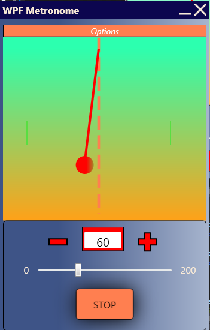

# WPFMetronome

# Introduction

The useful tool for musicians created using C# and Windows Presentation Foundation technology.
It is a simple aplication, in which we can choose an exact beat rate and after that it plays a sample sound in set tempo.
There are several sounds to choose and we can adjust a volume, obviously.

# WPF aspects implemented 
In this application a few WPF aspects has been implemented, like animations, media playing, styles and colors effects. 
The window has the layout's appearance similar to new Windows aplications style. I haven't used typical windows top bar with standard buttons for close/minimize/maximize of window and implemented my own bar with own buttons.

# GUI screen

